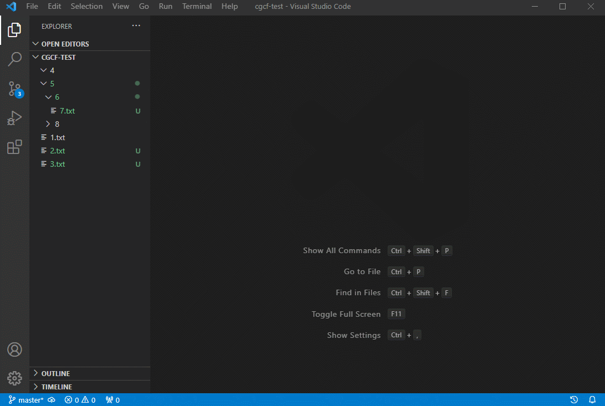

# Git Changes

这个拓展可以让你查看 git 项目中有改动的部分，包含文件和文件夹

This extension allows you to view changed parts of your git project, including files and folders.

## 如何使用

打开侧边栏 Source Control, 右键点击更改的文件，选择 Show Changes

在成功复制后，会自动打开存储所有改动文件的临时文件夹



## 特性

查看 git 项目中改动的文件和文件夹

支持选择部分改动查看

## 已知问题

目前仅支持 windows

改动的项目中含有中文的，可能会出现失败的情况，可尝试运行以下命令修复。

```bash
git config --global core.quotepath false
```

## 问题反馈与建议

[提交 ISSUE](https://github.com/jazzg62/cgcf-extension/issues/new)
